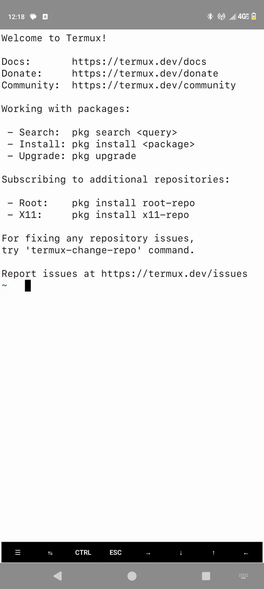

# Termux-Light-[Termux-Dark]
A utility to toggle termux-light theme and termux-dark theme  

<hr>  




<hr>  

#### Installation (automated):  
requirements: python, termux app  

run the installation script from the project directory:  

```python install.py```


#### Installation (manual):  
open the install script and manually move the files and add the commands to your .bashrc file
